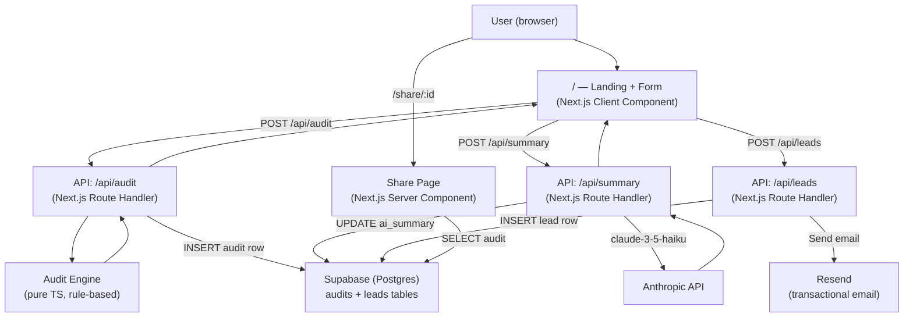

# Architecture

## System Diagram

## Data Flow

1. **User fills out form** — Tool list, plan, spend, seats, team size, use case. State is saved to `localStorage` on every change.

2. **POST /api/audit** — Form data is validated with Zod, passed through the audit engine (pure synchronous rules, no I/O), and the result is inserted into Supabase. A `shareId` (nanoid) is returned alongside the result.

3. **Results render** — Client shows savings hero, recommendation cards. Meanwhile, **POST /api/summary** fires asynchronously — Anthropic generates a ~100-word paragraph which updates the UI when ready.

4. **Lead capture** — User submits email. **POST /api/leads** looks up the audit, inserts a lead row, sends a transactional email via Resend (confirmation to user + internal alert for high-value leads).

5. **Share URL** — `/share/:id` is a server component that fetches the audit row from Supabase server-side. PII (email, company) is never stored in the audit row — only in the separate leads table. `generateMetadata` produces dynamic OG tags.

## Why This Stack

**Next.js (App Router)** — Handles both the frontend and API routes in a single deploy. Server components for the share page give us free SSR+OG without a separate server. The App Router's file-based routing makes the share URL (`/share/[id]`) trivial to implement.

**TypeScript** — The audit engine is pure calculation logic. Strong types prevent the class of bugs where a rule silently operates on undefined data (e.g., looking up a plan that doesn't exist). `PlanId = string` gives flexibility while `getPlan()` returns `null` safely.

**Tailwind CSS v4** — Co-located utility classes mean no context-switching to find styles. v4's `@import "tailwindcss"` model eliminates the config file for most use cases.

**Supabase** — Managed Postgres with a JavaScript client. RLS available when needed. The admin client (service key) is only used server-side in API routes. Free tier handles MVP traffic easily.

**Resend** — Simple API, reliable deliverability on free tier. The email just needs to send — no complex templating engine needed.

**In-memory rate limiter** — Chose a simple `Map`-based implementation over Upstash Redis to avoid another external dependency. Trade-off: resets on server restart and doesn't work across multiple instances. Acceptable for MVP; documented.

## What I'd Change at 10k Audits/Day

1. **Rate limiting** — Replace in-memory store with Upstash Redis (edge-compatible, survives restarts, works across instances).

2. **Supabase connection pooling** — Add PgBouncer via Supabase's connection pooler to avoid exhausting Postgres connections under load.

3. **AI summary queue** — At scale, fire-and-forget Anthropic calls would overwhelm the API rate limit. Move to a background job (e.g., Inngest or a Supabase Edge Function) that processes summaries from a queue with proper retry logic.

4. **CDN for share pages** — The share page is a server component today. At scale, cache rendered share pages at the CDN edge with a short TTL (5 min) to absorb viral spikes.

5. **Database indexes** — Add index on `audits.share_id` and `leads.email` (unique per audit). Currently fine for small tables; becomes critical at scale.
